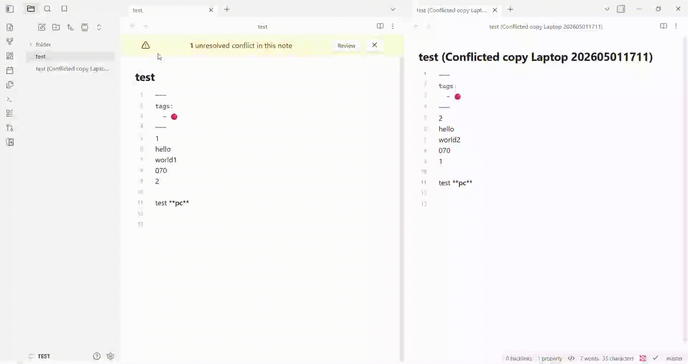

# Obsidian Conflict Manager



* **Alert Banner Notification:** A top-banner alerts you the exact moment unresolved sync conflicts are found in your current note.
* **Side-by-Side Diff Viewer:** Review differences between the original note and conflict files using an intuitive split-pane layout.

## Installation
Search **Conflict Manager** in the community plugins of Obsidian, then **Install** and **Enable** the plugin.

## FAQ
1) How to change colors ?
```css
@media (prefers-color-scheme: light) {
    .row-delete {
      background: rgba(var(--color-red-rgb), 0.07);
      .highlight-soft { background: rgba(var(--color-red-rgb), 0.15); }
      .highlight-strong { background: rgba(var(--color-red-rgb), 0.40); }
    }

    .row-insert {
      background: rgba(var(--color-green-rgb), 0.07);
      .highlight-soft { background: rgba(var(--color-green-rgb), 0.15); }
      .highlight-strong { background: rgba(var(--color-green-rgb), 0.40); }
    }
}

@media (prefers-color-scheme: dark) { /* same code for dark mode ... */ }
```

## Contributing
If you have any issues/suggestions, please open an issue on the repository.
If you'd like to contribute to the code, please fork the repository and submit a pull request.
