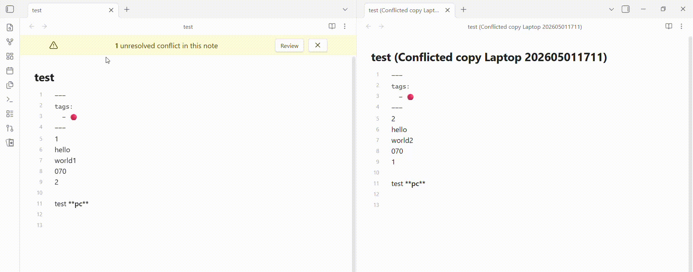

# Obsidian Conflict Manager


A simple plugin for conflict resolution. No more hunting through your file system. Just open your note, hit Review, and Resolve.

## Features

- **Alert Banner:** A top banner alerts you that your current note contains unresolved sync conflicts.
- **Diff Viewer:** Review differences between the original note and conflict files using an intuitive split-pane layout.
- **Status Bar Indicator:** Quickly view the status of conflicts in the vault.

## Installation

Search **Conflict Manager** in the community plugins of Obsidian, then **Install** and **Enable** the plugin.

## FAQ

#### How to change colors ?

```css
@media (prefers-color-scheme: light) {
  .row-delete {
    background: rgba(var(--color-red-rgb), 0.07);
    .highlight-soft {
      background: rgba(var(--color-red-rgb), 0.15);
    }
    .highlight-strong {
      background: rgba(var(--color-red-rgb), 0.4);
    }
  }

  .row-insert {
    background: rgba(var(--color-green-rgb), 0.07);
    .highlight-soft {
      background: rgba(var(--color-green-rgb), 0.15);
    }
    .highlight-strong {
      background: rgba(var(--color-green-rgb), 0.4);
    }
  }
}

@media (prefers-color-scheme: dark) {
  /* same code for dark mode ... */
}
```

#### When copying and pasting multiple lines in Obsidian, an extra line break is inserted.

Go to Setting > Editor > Convert pasted HTML to Markdown > toggle Disable.

## Contributing

If you have any issues/suggestions, please open an issue on the repository.
If you'd like to contribute to the code, please fork the repository and submit a pull request.
